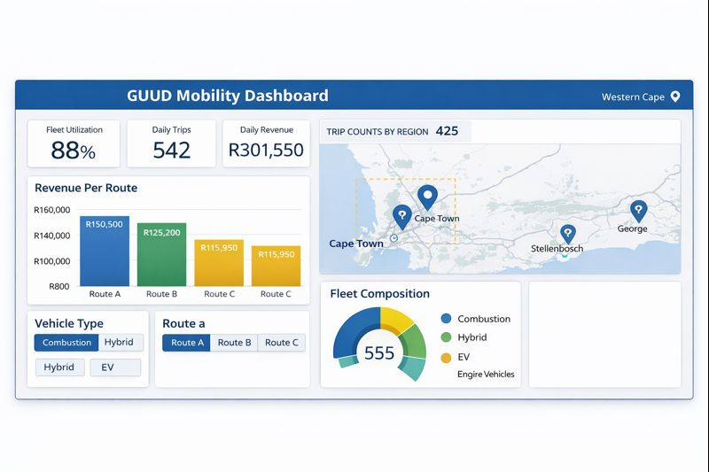

# 🌐 Azure Data Engineering Portfolio

---

## 👥 Intended Audience
- Data Engineers  
- BI & Analytics teams  
- Cloud architects  
- Recruiters / Hiring Managers

---

## 📌 Business Problem
Organizations often have **raw data spread across on-premise SQL Server systems**. Challenges include:  

- Manual ETL processes  
- Poor data quality and inconsistent schema  
- Limited real-time insights for analytics and reporting  

---

## 💡 Solution Overview
An **end-to-end Azure-based data engineering solution** that:  

1. **Ingests** data from on-premise SQL Server using **Azure Data Factory (ADF)**  
2. **Stores** raw data in **Azure Data Lake (ADLS)**  
3. **Transforms** data using **Azure Databricks** to create clean, analytics-ready datasets  
4. **Loads** clean data into **Azure Synapse Analytics** for enterprise querying  
5. **Visualizes** insights via **Power BI dashboards** connected to Synapse  
6. **Governance & monitoring** using **Azure Active Directory (AAD)** and **Azure Key Vault**  

---

## 🛠️ Technology Stack
- **Azure**: Data Factory, Databricks, Synapse Analytics, ADLS, Key Vault, AAD  
- **Python / PySpark** for transformations  
- **SQL / T-SQL** for queries and data modeling  
- **Power BI** for dashboards  
- **CI/CD / GitHub** for version control  

---

## 🔄 Architecture

*Data ingestion from on-premise SQL Server to ADLS via ADF pipelines.*

*Transform raw data to clean, structured data using Databricks notebooks.*

*Load clean data into Synapse Analytics for querying and reporting.*

*Interactive dashboards connected to Synapse for real-time analytics.*

---

## 🎯 Business Outcomes
- Automated end-to-end ETL pipelines, reducing manual effort  
- High-quality, clean, analytics-ready datasets  
- Near real-time dashboards for business insights  
- Secure data management with AAD and Key Vault  

---

## 🔗 Connect / Explore
- [GitHub Portfolio](https://github.com/AndiswaMatai/azure-data-engineering-portfolio)  
- [LinkedIn](https://www.linkedin.com/in/andiswamatai/)  
